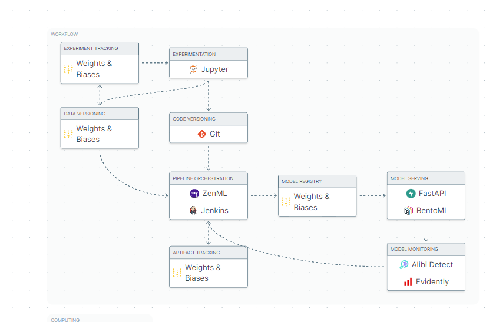

<h1 align="center">Hi there, I'm <a href="t.me/notedatascience" target="_blank">Daniil</a> 
</h1>
<h3 align="center"> Data Science student, IT news writer from Russia 🇷🇺</h3>


 **DontReadMe** - это сервис для чтения книг онлайн. Мы предоставляем доступ к бесплатной библиотеке 📚, которая содержит широкий выбор книг разных жанров и авторов.

##  Установка 
Чтобы начать использовать DontReadMe, вам нужно:


1. Установить версию **Python** 3.8.10

2. Клонировать репозиторий:
```
git clone https://github.com/torchme/mfdp.git .
cd mfdp
```

3. Установить зависимости:
```
pip install --upgrade pip
pip install --no-cache-dir -r requirements.txt
```
4. Запустить приложение:
```
streamlit run app.py --server.port=8081 --server.address=0.0.0.0
```
5. Открыть приложение в браузере:


Либо с помощью [**Docker**](https://hub.docker.com/repository/docker/redpowerful/mfdp/general) 

```
docker build -t redpowerful/mfdp:latest .
docker run -p 8081:8081 redpowerful/mfdp:latest
```

##   Использование
**DontReadMe** предоставляет доступ к бесплатной библиотеке книг, которые вы можете читать онлайн. Вы можете искать и фильтровать книги по жанру и автору, а также добавлять книги в свой список избранных.

##   Поддержка
Если у вас есть вопросы или предложения по улучшению DontReadMe, пожалуйста, свяжитесь с нами по адресу support@dontreadme.com.

##   Лицензия
DontReadMe распространяется под лицензией MIT. Подробнее см. в файле LICENSE.

##   Авторы
Kartushov Danil Romanovich (@torchme) - Разработчик
_Этот проект создан и поддерживается командой DontReadMe._

# Дизайн

##   Технологии
* Streamlit - фреймворк для веб-приложений на языке Python
* Docker - платформа для разработки, доставки и запуска приложений в контейнерах.
* Python - язык программирования, на котором написана рекомендательная система.
* Pandas - библиотека для работы с данными в Python.
* NumPy - библиотека для научных вычислений на языке Python.
* Implicit - библиотека для разработки рекомендательных систем.
* WandB - библиотека для мониторинга обучения моделей.
* MKDocs - библиотека для создания документации
* Autohooks & Co - библиотеки для поддержки кода разработчиков

##  Систем Дизайн
* **[Miro](https://miro.com/app/board/uXjVMYFj-Ro=/?share_link_id=287605501439)**



Для создания системы рекомендательной системы для библиотек можно использовать следующий подход:

**Backend MVP:** создать минимальный backend с возможностью __cold start__, который позволит получить первые результаты рекомендаций.

**Разработка МЛ модели:** для рекомендаций книг можно использовать различные МЛ алгоритмы, такие как Collaborative Filtering, Content-Based Filtering или Hybrid Filtering. Важно выбрать наиболее подходящую модель для конкретной задачи и провести ее обучение на подготовленных данных. Для измерения качества модели необходимо использовать метрики, такие как MAP@k, Precision-Recall, AUC и NDCG@k.

**Валидация и оптимизация МЛ модели:** после обучения модели необходимо проверить ее на валидационном наборе данных и провести оптимизацию гиперпараметров для улучшения качества рекомендаций. Важно учитывать время, необходимое для получения рекомендаций, чтобы обеспечить быстродействие системы.

**ML Ops:** ZenML, WB, BentoML, Alibi Detect, Evidently, ITMOFS
ETL: ITMOFS, JENKINS/ZENML, Postgres, Superset

**ML:** ALS, LightFM, CatBoost, Time Series Validation

**Frontend:** добавить функции и простой фронтенд для взаимодействия пользователя. Для создания фронтенда можно использовать фреймворки, такие как Streamlit, Flask или Django. Необходимо разработать интерфейс для ввода данных о пользователе и книгах, а также отображение результатов рекомендаций. Необходимо также разработать систему регистрации пользователей и логирования действий.

**Деплой:** развернуть систему на сервере и обеспечить ее работу на постоянной основе. Для этого можно использовать такие сервисы, как AWS, Google Cloud или Microsoft Azure. Необходимо также обеспечить безопасность системы и защиту данных пользователей. Но для MVP достаточно использовать github/streamlit pages.
##  Архитектуры & Модели
Для реализации рекомендательной системы DontReadMe используется алгоритм коллаборативной фильтрации, который основывается на истории действий пользователя и на его интересах. Алгоритм использует матрицу рейтингов, которая содержит информацию о предпочтениях пользователей, а также сходства между пользователями.

Рекомендательная система DontReadMe имеет следующие компоненты:

* Интерфейс пользователя, который разработан с помощью фреймворка Streamlit.
* База данных, которая содержит информацию о книгах и пользователях.
* Модуль для обработки данных, который использует библиотеки Pandas и NumPy.
* Модуль для построения матрицы рейтингов, который использует алгоритм коллаборативной фильтрации.
* Модуль для предоставления рекомендаций пользователю, который использует библиотеку Implicit.

ALS (Alternating Least Squares) и BM25 (Best Matching 25) - это два различных подхода, используемых в рекомендательных системах для определения наиболее подходящих элементов для пользователя.

**ALS** - это метод коллаборативной фильтрации, который основывается на разложении матрицы рейтингов на две матрицы меньшего размера, которые содержат скрытые факторы. Алгоритм оптимизирует эти матрицы с помощью альтернативной минимизации на каждой итерации, пока не будет достигнуто определенное количество итераций или пока не будет достигнута сходимость. После оптимизации матрицы, ALS может использоваться для предоставления рекомендаций пользователю.

**BM25** - это алгоритм ранжирования, который используется для оценки релевантности документов в поисковых системах. Он основывается на формуле, которая учитывает частоту слова в документе и общую частоту слова в коллекции документов. BM25 также учитывает длину документа и частоту слова в запросе пользователя. Алгоритм используется для сопоставления запроса пользователя с документами в коллекции и ранжирования их по убыванию релевантности.

Оба подхода могут быть эффективными в рекомендательных системах, в зависимости от контекста применения. ALS часто используется в системах, где есть информация о рейтингах пользователей, например, в системах рекомендации фильмов. BM25 часто используется в поисковых системах и системах рекомендации контента на основе текстовых данных, например, в системах рекомендации статей или книг.

##  Деплоймент
Конечный этап разработки проекта DontReadMe - его деплоймент. Это важный процесс, который включает в себя множество шагов, начиная от тестирования и сборки приложения, и заканчивая настройкой мониторинга и обновлением. В этой статье мы рассмотрим процесс деплоймента для проекта DontReadMe, описав каждый шаг и детали, которые помогут вам успешно развернуть ваше приложение в производственной среде.
* [Docker](https://hub.docker.com/repository/docker/redpowerful/mfdp/general)
* [GitHub](https://github.com/torchme/mfdp)
* [API](https://torchme.github.io/mfdp/)
* [WANDB](https://wandb.ai/torchme/MFDP/reports/MFDP-Report--Vmlldzo0MzUxNTcw)
* [Streamlit](https://torchme-mfdp-app-lsqnda.streamlit.app/)
